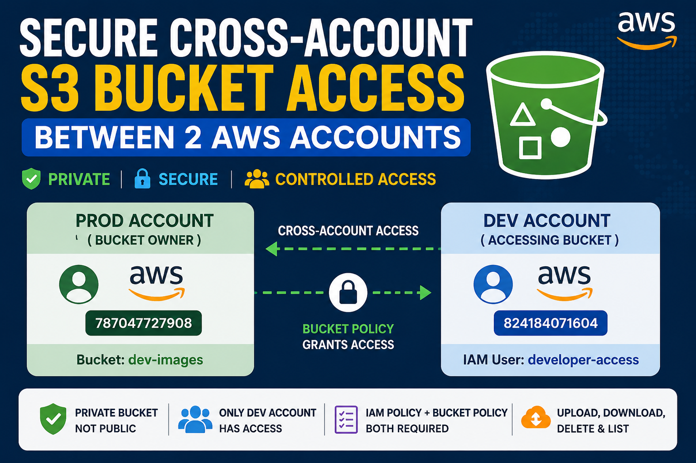

# Secure Cross-Account Amazon S3 Access Between AWS Accounts — Complete Step-by-Step Guide


## 📚 Full Step-by-Step Blog

This repository contains the implementation files and commands used in the complete Medium tutorial.

👉 Read the full article here:

[Cross-Account Access to Amazon S3 Bucket Between 2 AWS Accounts](https://medium.com/@tradingcontentdrive/cross-account-access-to-amazon-s3-bucket-between-2-accounts-077e0e9f44d8?postPublishedType=repub)

## Introduction

A few months ago, our organization separated workloads into multiple AWS accounts to improve security and management. The production environment was hosted in a dedicated AWS account, while developers worked from a separate development account.

The development team regularly built application images, deployment packages, and CI/CD artifacts that needed to be consumed by production workloads. To centralize and securely store these files, the production account maintained an Amazon S3 bucket named:

```bash
dev-images
```

A common requirement is:

> How can one AWS account securely access an S3 bucket located in another AWS account?

Soon, the development team needed access to these files for:

- Application testing
- CI/CD deployments
- Pulling build artifacts
- Sharing static assets across environments

At first, the easy option looked tempting:

```bash
Make the bucket public
```

But that would have been a terrible decision.

Public buckets are one of the most common causes of AWS security incidents. Exposing internal artifacts or backups publicly can become a disaster very quickly.

This setup is called:

```bash
Cross-Account S3 Access
```

The goal was simple:

- Keep the bucket private
- Allow only the Dev Account to access it
- Avoid public exposure
- Provide secure and controlled permissions

In this guide, we will implement that exact real-world setup step-by-step using:

- Amazon S3 Bucket Policies
- IAM Policies
- AWS CLI

By the end, the Dev Account will be able to securely upload, download, list, and manage objects inside the Production Account’s S3 bucket without using public access or complicated AssumeRole configurations.

---

# Environment Details

| Account | Purpose | Account ID |
|----------|----------|-------------|
| Prod Account | Bucket Owner | `787047727908` |
| Dev Account | Accessing Bucket | `824184071604` |

Bucket name:

```bash
dev-image507
```

---

# Architecture

```text
Dev Account
(IAM Permissions)
      |
      |
      V
Amazon S3 Bucket (dev-image507)
      ^
      |
      |
Bucket Policy
      |
      |
Prod Account
(Bucket Owner)
```

---

# Step 1 — Login to AWS Prod Account

Open AWS Console and login using Prod Account credentials.

---

# Step 2 — Open Amazon S3

Open Amazon S3 Console.

---

# Step 3 — Create the S3 Bucket

Click:

```bash
Create bucket
```

Provide:

| Field | Value |
|------|------|
| Bucket Name | `dev-image507` |
| AWS Region | Preferred Region |
| Object Ownership | ACLs disabled |
| Block Public Access | Keep enabled |

Click:

```bash
Create bucket
```

---

# Step 4 — Open Bucket Permissions

Open bucket:

```bash
dev-image507
```

Go to:

```bash
Permissions
```

---

# Step 5 — Add Cross-Account Bucket Policy

Go to:

```bash
Bucket Policy → Edit
```

Paste:

```json
{
  "Version": "2012-10-17",
  "Statement": [
    {
      "Sid": "AllowDevAccount",
      "Effect": "Allow",
      "Principal": {
        "AWS": "arn:aws:iam::824184071604:user/developer-access"
      },
      "Action": "s3:*",
      "Resource": [
        "arn:aws:s3:::dev-image507",
        "arn:aws:s3:::dev-image507/*"
      ]
    }
  ]
}
```

Save changes.

---

# Understanding the Bucket Policy

## Principal

```json
"Principal": {
  "AWS": "arn:aws:iam::824184071604:user/developer-access"
}
```

This means:

```bash
Allow IAM user developer-access from Dev Account to access this bucket.
```

---

## Action

```json
"Action": "s3:*"
```

This grants:

- Upload permissions
- Download permissions
- Delete permissions
- List bucket permissions
- Full S3 access

---

## Resource

### Bucket-Level Access

```json
"arn:aws:s3:::dev-image507"
```

Used for:

- ListBucket
- Bucket metadata operations

### Object-Level Access

```json
"arn:aws:s3:::dev-image507/*"
```

Used for:

- GetObject
- PutObject
- DeleteObject

Both are mandatory.

---

# Step 6 — Login to AWS Dev Account

Logout from Prod Account and login to Dev Account.

---

# Step 7 — Create IAM User in Dev Account

Open IAM Console.

Go to:

```bash
Users → Create user
```

User name:

```bash
developer-access
```

Enable:

```bash
Access key access
```

Create user.

---

# Step 8 — Create Access Key

Open user:

```bash
developer-access
```

Go to:

```bash
Security credentials
```

Scroll to:

```bash
Access keys
```

Click:

```bash
Create access key
```

Select:

```bash
Command Line Interface (CLI)
```

Create access key and copy:

- Access Key ID
- Secret Access Key

---

# Step 9 — Attach IAM Policy to User

Go to:

```bash
Permissions → Add permissions → Create inline policy
```

Select:

```bash
JSON
```

Paste:

```json
{
  "Version": "2012-10-17",
  "Statement": [
    {
      "Effect": "Allow",
      "Action": "s3:*",
      "Resource": [
        "arn:aws:s3:::dev-image507",
        "arn:aws:s3:::dev-image507/*"
      ]
    }
  ]
}
```

Policy name:

```bash
dev-image507-access
```

Create policy.

---

# Step 10 — Launch Ubuntu EC2 Server in Dev Account

Open EC2 Console.

Click:

```bash
Launch instance
```

Name:

```bash
ubuntu-server
```

AMI:

```bash
Ubuntu Server 24.04 LTS
```

Instance Type:

```bash
t2.micro
```

---

# Step 11 — Create Key Pair

Click:

```bash
Create new key pair
```

Name:

```bash
ubuntu-key
```

Key type:

```bash
RSA
```

Format:

```bash
.pem
```

Create key pair.

---

# Step 12 — Configure Network

Allow:

- SSH
- HTTP
- HTTPS

Keep:

```bash
Allow SSH traffic from My IP
```

Launch instance.

---

# Step 13 — Connect to Ubuntu Server

Run:

```bash
chmod 400 ubuntu-key.pem
```

Connect:

```bash
ssh -i ubuntu-key.pem ubuntu@<PUBLIC_IP>
```

---

# Step 14 — Install AWS CLI

Run:

```bash
sudo apt update
sudo apt install unzip curl -y

curl "https://awscli.amazonaws.com/awscli-exe-linux-x86_64.zip" -o "awscliv2.zip"

unzip awscliv2.zip

sudo ./aws/install
```

Verify:

```bash
aws --version
```

---

# Step 15 — Configure AWS CLI

Run:

```bash
aws configure
```

Enter:

- AWS Access Key
- AWS Secret Key
- Region
- json

---

# Step 16 — Verify Current AWS Identity

Run:

```bash
aws sts get-caller-identity
```

Example output:

```json
{
    "UserId": "AIDA37ZJS4W2EKP2WQ3EM",
    "Account": "824184071604",
    "Arn": "arn:aws:iam::824184071604:user/developer-access"
}
```

This command verifies:

- Current AWS account
- Current IAM user
- Correct AWS credentials
- Which account AWS CLI is authenticated against

This is extremely useful for troubleshooting:
- AccessDenied errors
- Wrong credentials
- Wrong AWS account access
- Cross-account access issues

---

# Step 17 — Verify Access

## List Bucket

```bash
aws s3 ls s3://dev-image507
```

## Upload File

```bash
echo hello > test.txt

aws s3 cp test.txt s3://dev-image507/
```

## Download File

```bash
aws s3 cp s3://dev-image507/test.txt .
```

## Delete File

```bash
aws s3 rm s3://dev-image507/test.txt
```

---

# Why AssumeRole Is Not Required

AssumeRole is NOT needed in this setup.

Because we are using:

```json
"Principal": {
  "AWS": "arn:aws:iam::824184071604:user/developer-access"
}
```

This is called:

```bash
Direct Cross-Account Access
```

AWS Dev Account directly accesses the bucket using its own IAM credentials.

No STS.
No AssumeRole.
No role switching.

---

# When AssumeRole Is Normally Used

AssumeRole is commonly used when:

- Temporary credentials are required
- Centralized access management is needed
- Enterprise role-based access is implemented
- Cross-account role switching is preferred
- Avoiding direct bucket permissions to users

---

# Access Flow

```text
IAM User in Dev Account
        |
        |
IAM Policy Allows Access
        |
        |
S3 Bucket Policy in Prod Account Trusts Dev Account
        |
        |
Access Granted
```

---

# Common Mistakes

## Missing Object-Level ARN

Wrong:

```json
"arn:aws:s3:::dev-image507"
```

Correct:

```json
"arn:aws:s3:::dev-image507/*"
```

Both are required.

---

## Missing IAM Policy

Bucket policy alone is not enough for IAM users.

AWS evaluates:

- IAM Policy
- Bucket Policy

Both must allow access.

---

## Confusing Public Access With Cross-Account Access

This configuration:

- Is NOT public
- Only allows Dev Account
- Keeps bucket private

---

# Conclusion

Cross-account S3 access is one of the most important concepts in AWS multi-account architectures. Many engineers struggle with it because they misunderstand how IAM policies and bucket policies work together.

The reality is simple:

- Bucket policy grants trust
- IAM policy grants permission
- Both are required

By implementing this correctly, you create a secure and scalable architecture where AWS accounts can safely share storage resources without exposing data publicly.

This setup is widely used for:

- Shared DevOps artifacts
- Centralized logging
- Terraform remote state
- CI/CD pipelines
- Backup repositories
- Enterprise AWS environments

Once you understand this pattern, implementing secure cross-account AWS architectures becomes significantly easier.
